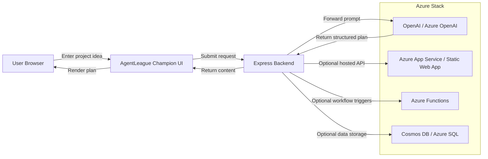

# Architecture Diagram

## Architecture components

- **User Browser**: The front-end UI for idea entry, track selection, and plan generation.
- **Express Backend**: Hosts the API, validates requests, and orchestrates AI prompt execution.
- **OpenAI / Azure OpenAI**: Powers the reasoning logic, generating structured hackathon deliverables.
- **Agent Layer**: Encapsulates the prompt engineering, track alignment, and submission-aware output.
- **Azure services**: Optional extension points for deployment, storage, and workflow automation.

## Microsoft technology mapping

- **Azure OpenAI**: Core large-language model for reasoning, planning, and pitch generation.
- **Microsoft Foundry**: Can host the agent orchestration layer and support multi-step workflows.
- **Agent Framework**: The design mirrors agent planning, action selection, and response generation.
- **Azure App Service / Static Web Apps**: Deploy the UI and backend for a production-ready demo.
- **Cosmos DB / Azure SQL**: Store user prompts, generated plans, and submission history if extended.
- **Azure Functions**: Add event-driven logic for advanced feature expansion.
